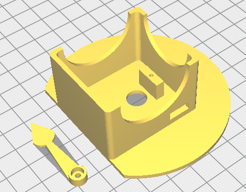
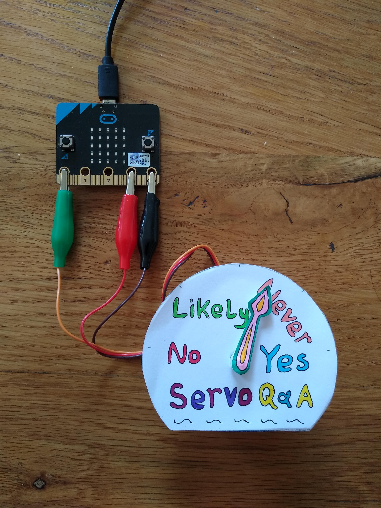

# Microbit-Servo-Magic-8-Ball
Find the answers to difficult decisions with the help of a Microbit and a servo.

There is a base and an arrow to 3D print along with this. These files are included.



# Microbit Servo Magic 8 Ball

The Magic 8 Ball is a device that answers questions you put to it with random prearranged answers. If you can phrase 
your question so that the answer is either a yes, no or something in between then an 8 Ball can help you.

This exercise produces much the same thing except that the answer is indicated by a pointer. 

## Requirements
- Microbit
- Servo base and crocodile clips
- Templates
- Art supplies


## Get Creative
The first stage is to create the artwork that will adorn your creation. This will consist of the base with your answers 
and the pointer. Consider what answers you want your device to give. They may be helpful or not! It is entirely up to you.



Draw around the rounded base and the arrow onto some paper. Get creative with how the base looks. Also design your pointer too. 
Cut the designs out, glue gently onto the servo base and the arrow. Don’t put the arrow onto the servo just yet.

## First Code
Initially to get the arrow in the correct position the servo needs to be set to the middle point and the arrow placed 
point towards the top. Servos work by a pulse being sent to them. Servo motors determine their position by the ratio 
of on time and off time in an (approximately) 20 millisecond (ms) pulse. Values between 1 and 180 determine the position 
of the servo in their 180 degree sweep. A value of 90 should place the pointer somewhere in the middle of the movement. 
With the servos we have the value for the middle is 75.

Start up the Mu editor with a new tab and enter the following code.
```
from microbit import *

pin0.set_analog_period(20)

pin0.write_analog(75)
```

Of these three lines of code the last is the one that controls where the servo rotates to. Connect the Microbit to the computer 
and the servo to the Microbit as in the picture. Pin0 is just because the servo is connected to zero, or should be. Run the code 
by flashing to the Microbit using the Flash button. The servo should rotate and stop. Now place the arrow onto the servo spindle
and screw into place.

## Finding the Limits
The upper and lower limits mentioned above are not necessarily correct. If the servo swings too far it can lock up if held there 
too long. Using the code below keep adjusting the values upwards towards 180 and down towards 1 until the arm swings smoothly 
between the two settings. Keep changing the clockwise/anticlockwise values and reflashing the code until you are happy.

Here the clockwise and anticlockwise are variables. Variables because they can be changed, they are variable! 
The names are just a useful label and nothing more. They have no actual effect. The name left and right would work as 
would back and forth.

The variables are dropped into the write_analog lines as needed.
```
from microbit import *

pin0.set_analog_period(20)

clockwise = 30      # our values were 25
anticlockwise = 130 # and 145

while True:
    pin0.write_analog(clockwise)
    sleep(2000)
    pin0.write_analog(anticlockwise)
    sleep(2000)
```

To turn off the servo just disconnect the ground lead. And reconnect when needed.

## Point to the Answers
Once you have found the limits then find the positions of your answers. Add more variables and adjust until the arrow 
can point at the answers.

The version of answers pictured required four pointer positions. Your version may need more values to point in the correct 
positions. Use the code below to set your positions up. Label them to match your answers. Your labels must be a single word 
such as not_likely or notLikely.
```
from microbit import *

pin0.set_analog_period(20)

yes = 25
never = 58
likely = 93   
no = 145

while True:
    pin0.write_analog(yes)
    sleep(2000)
    pin0.write_analog(never)
    sleep(2000)
    pin0.write_analog(likely)
    sleep(2000)
    pin0.write_analog(no)
    sleep(2000)
```

## Obtaining the Random Choice
The code now has four answers, in the example, and four corresponding servo values. The task now is to randomly select one answer.

To demonstrate this random ability switch to the Read, Evaluate, Print, Loop mode on Mu, by clicking the REPL button. 
Here you will be able to try some live code and immediately see the result.

Type in this at the chevrons, which indicate live coding in Python.
```
>>>outcomes = {“yes”:25, “no”:145}
>>>print(outcomes)
```
You should get the response after the last line of:
```
>>>{“yes”:25, “no”:145} 
```
This shows that a dictionary with names and corresponding values have been entered correctly. If it didn’t work check that 
the brackets are { } not ( ). And there are “  “ around the words yes and no.


To access the values, code needs to ask for a key, yes or no, and then the value, 25 or 145, of that key.
This may help with the explanation. This isn't code to type in.
```
dictionaryName = {“keyName1” : value1, “keyName2” : value2}
```
A dictionary value can be a word like a real dictionary but here the value is servo position number.

Try the following:
```
>>>outcomes.keys()
>>>dict_keys([“yes”, ”no”])
>>>outcomes.values()
>>>dict_values([25, 145])
```
This demonstrates that the values can be extracted from the dictionary. A specific value for a known key can be found 
by asking for it. But this presumes the name is already known and therefore is not a random choice.
```
>>>outcomes[“yes”]
>>>25
```
The next stage extracts the values and places them in a list.
```
>>>list(outcomes.values())
>>>[25, 145]
```
Once in a list it is possible to select a value randomly. The following lines import the random ability into Python and 
then makes a random choice from the list of outcomes values.
```
>>>import random
>>>random.choice(list(outcomes.values()))
>>>25
```

## The Full Code
The final part is to get an answer when requested. The simplest way is to press a button. So if button A is pressed only 
then look up a random value and point the servo using that value. Here is the full code with our values and names.
```
from microbit import *
import random

pin0.set_analog_period(20)

outcomes = {"yes":23, "never":58, "likely":93, "no":140}

while True:
    if button_a.is_pressed():
        answer = random.choice(list(outcomes.values()))
        pin0.write_analog(answer)
        sleep(200)
